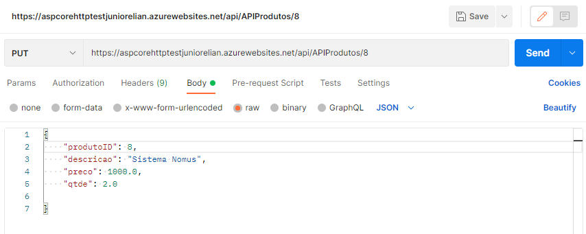

# API Produtos Ploomes

A API Produtos Ploomes é uma API básica de CRUD, onde é possível realizar através de API REST a obtenção e envio de dados para um serviço de `Produtos`. Com o banco de dados SQL Server hospedado no Microsoft Azure.

Além disso, a aplicação está hospedada [aqui](https://aspcorehttptestjuniorelian.azurewebsites.net) no Microsoft Azure caso queira ver uma interface gráfica em conjunto do  acontecendo as coisas (e por lá você consegue algumas informações minhas também).

A aplicação foi desenvolvida em .NET C# versão 2.1, utilizando `Entity Framework` para a construção da interface gráfica com SQL Server e a API. Criada com o intuito de satisfazer o teste prático para a empresa Ploomes, onde era necessário construir uma API.

Este projeto foi fundamental para o meu desenvolvimento na linguagem C#, uma vez que não tinha experiência concreta com criação de API, e com isto pude ver na prática como funciona API. Meus estudos continuam relacionados a criação de API, utilizei do Framework para ganhar tempo e conseguir realizar a atividade.

## Recomendações


Para está API, é utilizado `HTTP` para a realização das requisições. Recomendo fortemente a utilização do Framework `Postman` para realizar as requisições e testes.
Além disso, o formato de retorno é `JSON`.

Para todas as requisições, você deve utilizar a URL abaixo.

```bash
https://aspcorehttptestjuniorelian.azurewebsites.net/
```

## Observação
O produto utilizado aqui é um produto de valor e quantidade fictício e foram utilizados meramente para ilustrar a utilização da API.

Além disso, foi criado, editado e excluído, a fim de confirmar e demonstrar as respostas de cada requisição.

## Listar Produtos
Para listar todos os produtos através da API, você deve fazer uma requisição do tipo `GET`.

### Exemplo
<h1 align="center">
  
</h1>

### Requisição

```api
GET /api/APIProdutos/
```
### Resposta
```
Status: 200 OK
```
```json
[
    {
        "produtoID":1,
        "descricao":"Sistema Ploomes",
        "preco":207.0,
        "qtde":1.0,
        "valorEstoque":207.0
    },
    {
        "produtoID":2,
        "descricao":"Sistema SOC",
        "preco":1000.0,
        "qtde":1.0,
        "valorEstoque":1000.0
    },
    {
        "produtoID":3,
        "descricao":"Sistema Despnet",
        "preco":207.0,
        "qtde":1.0,
        "valorEstoque":207.0
    },
    {
        "produtoID":4,
        "descricao":"Sistema Station",
        "preco":2000.0,
        "qtde":1.0,
        "valorEstoque":2000.0
    },
    {
        "produtoID":5,
        "descricao":"Sistema SAP",
        "preco":3000.0,
        "qtde":1.0,
        "valorEstoque":3000.0
    },
    {
        "produtoID":6,
        "descricao":"Sistema ERPFlex",
        "preco":1000.0,
        "qtde":1.0,
        "valorEstoque":1000.0
    },
    {
        "produtoID":7,
        "descricao":"Sistema eGestor",
        "preco":500.0,
        "qtde":1.0,
        "valorEstoque":500.0
    }
]
```

## Listar um Produto
Para listar algum produto em específico através da API, você deve fazer uma requisição do tipo `GET` e passar como parâmetro o `id` do produto em questão.

### Exemplo
<h1 align="center">
  
</h1>

### Requisição

```api
GET /api/APIProdutos/{id}
```
### Resposta
```
Status: 200 OK
```
```json
{
    "produtoID":1,
    "descricao":"Sistema Ploomes",
    "preco":207.0,
    "qtde":1.0,
    "valorEstoque":207.0
}
```

## Criar um Produto
Para criar um produto novo através da API, você deve fazer uma requisição do tipo `POST`, criar um body `raw` e selecionar o tipo `JSON`.

### Exemplo
<h1 align="center">
  
</h1>

### Requisição

```api
POST /api/APIProdutos/
```
### Body
```json
{
    "descricao": "Sistema Nomus",
    "preco": 870.0,
    "qtde": 2.0,
    "valorEstoque": 1740.0
}
```
* Apenas um toque, não é necessário digitar o `valorEstoque` (como vimos no exemplo) por ser uma valor dinâmico criado a partir da multiplicação do `preço` e a `qtde`.
### Resposta
```
Status: 201 Created
```
```json
{
    "produtoID":8,
    "descricao":"Sistema Nomus",
    "preco":870.0,
    "qtde":2.0,
    "valorEstoque":1740.0
}
```

## Editar um Produto
Para editar um produto específico através da API, você deve fazer uma requisição do tipo `PUT`, passar como parâmetro o `id` do produto em questão, além de criar um body `raw` e selecionar o tipo `JSON`.

### Exemplo
<h1 align="center">
  
</h1>

### Requisição

```api
PUT /api/APIProdutos/{id}
```
### Body
```json
{
    "produtoID": 8,
    "descricao": "Sistema Nomus",
    "preco": 1000.0,
    "qtde": 2.0,
    "valorEstoque": 2000.0
}
```
* Novamente, não é necessário digitar o `valorEstoque` (como no exemplo) por ser uma valor dinâmico criado a partir da multiplicação do `preço` e a `qtde`.
### Resposta
```
Status: 204 No Content
```
Neste caso, por ser um tipo `PUT` nós não recebemos uma resposta visual do que ocorreu, mas caso você utilize agora uma requisição `GET` para listar o produto em específico:
```
GET /api/APIProdutos/{id}
```
```json
{
    "produtoID":8,
    "descricao":"Sistema Nomus",
    "preco":1000.0,
    "qtde":2.0,
    "valorEstoque":2000.0
}
```
E aí está! O produto foi atualizado através de uma requisição `HTTP` utilizando `JSON`.

## Excluir um Produto
Para excluir algum produto em específico através da API, você deve fazer uma requisição do tipo `DELETE` e passar como parâmetro o `id` do produto em questão, além de criar um body `raw` e selecionar o tipo `JSON`.

### Exemplo
<h1 align="center">
  
</h1>

### Requisição

```api
DELETE /api/APIProdutos/{id}
```
### Body
```json
{
    "produtoID": 8
}
```
### Resposta
```
Status: 200 OK
```
```json
{
    "produtoID":8,
    "descricao":"Sistema Nomus",
    "preco":1000.0,
    "qtde":2.0,
    "valorEstoque":2000.0
}
```
Para comprovar que foi excluído, você pode fazer um requisição do tipo `GET` passando o parâmetro `id` para selecionar o produto em específico.

```
GET /api/APIProdutos/{id}
```
E então você receberá uma resposta 404, indicando que não foi encontrado.
```
Status: 404 Not Found
```
